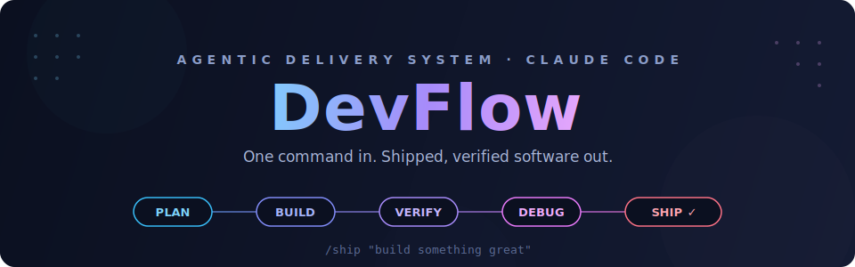
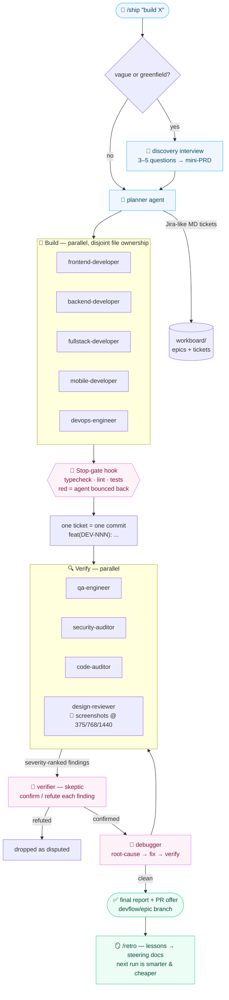

<div align="center">



<br/>


**Plan → Tickets → Build → QA · Security · Audit · Design → Debug → Ship.**
<br/>A portable agent team you install into any project — driven from one terminal, with one command.

[Quick start](#-quick-start) · [How it works](#-how-it-works) · [Commands](#-commands) · [The crew](#-the-crew) · [Guarantees](#-hard-guarantees) · [Token efficiency](#-token-efficiency)

<br/>



</div>

> **⚡ Copy, paste, ship** — hover the block and hit the copy button, then run it in your terminal:

```powershell
git clone https://github.com/ljojua1998/skills.git; cd skills; .\install.ps1 -Global
```

<details>
<summary>macOS / Linux one-liner</summary>

```bash
git clone https://github.com/ljojua1998/skills.git && cd skills && ./install.sh --global
```

</details>

Then open any project and type: &nbsp;`claude` → `/ship "build something great"`

---

## 🚀 Quick start

```powershell
# 1. get DevFlow
git clone https://github.com/ljojua1998/skills.git
cd skills

# 2. install into your project        (or globally, for every project: .\install.ps1 -Global)
.\install.ps1 -Target "C:\path\to\your\project"      # macOS/Linux: ./install.sh /path/to/project

# 3. open Claude Code in the project and ship
cd C:\path\to\your\project
claude
```

```text
> /ship --review "Build a personal expense tracker: categories, monthly chart, Express + SQLite"
```

That's it. DevFlow interviews you if the idea is vague, writes a Jira-like plan,
asks for your approval (`--review`), builds every ticket with specialist agents,
runs four kinds of review, debugs until clean, and hands you a branch + report.

<details>
<summary><b>📋 Full walkthrough — first run, what happens, updating (click to expand)</b></summary>
<br/>

### Prerequisites (one-time)

- **Claude Code** installed and logged in (`npm i -g @anthropic-ai/claude-code`, then `claude`).
- **Git** installed (on Windows this also provides Git Bash, which the quality-gate hook uses).
- Keep the cloned repo somewhere permanent — it's the source you install *from* and update *in*.

### Install options

**Per project** (recommended — the system travels with the repo, teammates get it via git):

```powershell
.\install.ps1 -Target "C:\path\to\your\project"      # Windows
./install.sh /path/to/your/project                   # macOS / Linux
```

Commit the project's `.claude/` folder so the whole team has the same pipeline.

**Global** (available in every project on this machine):

```powershell
.\install.ps1 -Global                                # or: ./install.sh --global
```

For a brand-new idea with no code yet: create an empty folder, install into it,
and let `/ship` scaffold the whole project.

### What the first run does automatically

1. Creates `workboard/` (the Jira-style board) plus `workboard/steering/` docs
   describing your stack and conventions — the project's constitution.
2. Makes the project a git repo if it isn't one; works on a `devflow/epic-001-...`
   branch. **Never merges or pushes without your explicit yes.**
3. Planner presents the ticket breakdown → building starts — each finished ticket
   is one conventional commit → QA/security/audit/design review → debugger fixes
   confirmed findings → final report.

### While it runs / after it finishes

- `/board` — epics, tickets, statuses, open findings at any time.
- `/ship resume` — an interrupted session picks up exactly where the board says it stopped.
- Review the report and the `devflow/epic-NNN-*` branch, then merge it yourself:
  ```bash
  git checkout main && git merge devflow/epic-001-expense-tracker
  ```

### Updating DevFlow later

Inside any project: `/devflow-update` — pulls the latest from this repo and
reinstalls itself. Or manually: re-run the installer with `-Force` / `--force`.

### Verify the install worked

Type `/` in Claude Code — you should see `ship`, `board`, `qa`, `security-audit`,
`retro` in the list. Missing? Restart the Claude Code session; then check that
`.claude/skills/` and `.claude/agents/` exist in the project (or `~/.claude/` for
global installs).

</details>

## ⚙️ How it works



Everything is **state-on-disk**: tickets are markdown files with frontmatter
statuses, agents communicate by appending to ticket sections, and any new session
can resume the pipeline from the board alone.

## 🎛 Commands

| Command | What it does |
|---|---|
| `/ship "<task>"` | The full pipeline: plan → tickets → build → verify → debug → report. Asks at launch: capped or loop-until-done |
| `/ship --review "<task>"` | Pause after planning — the plan needs your approval before building starts |
| `/ship --loop "<task>"` | **Loop-until-done**: keep cycling until the Definition of Done is fully met — no caps, only progress guards |
| `/ship --quick "<task>"` | Small tweak — minimal pipeline (one dev, QA only) |
| `/ship --full "<task>"` | Maximum rigor — all four reviewers, every phase |
| `/ship --budget "<task>"` | Economy run — worker agents on Sonnet (planner/verifier/debugger stay on the session model) |
| `/ship --discover "<idea>"` | Force the discovery interview: questions → mini-PRD → plan |
| `/ship resume` | Continue an interrupted run from the workboard state |
| `/board` | Jira-style status view: epics, tickets, open findings, blockers (`add` / `close` / `block` / `priority` subcommands) |
| `/qa [scope]` | Standalone QA pass on recent changes |
| `/security-audit [scope\|full]` | Standalone OWASP-style security review |
| `/debug-findings` | Fix open findings from any review |
| `/retro [EPIC-NNN]` | Distill the epic's lessons into steering docs (auto-runs on standard/full ships) |
| `/devflow-update` | Pull the latest DevFlow from this repo and reinstall |

## 🤖 The crew

| Agent | Role | Preloaded craft |
|---|---|---|
| 🧠 `planner` | Analyzes request + codebase → architecture decision + ticket breakdown | — |
| 🎨 `frontend-developer` | UI features: components, state, styling, a11y | frontend-craft, testing-craft |
| 🔩 `backend-developer` | APIs, services, data models, migrations, auth | backend-craft, testing-craft |
| 🌉 `fullstack-developer` | Vertical slices: contract-first server + client | backend-, frontend-, testing-craft |
| 📱 `mobile-developer` | RN/Expo/Flutter/native screens, offline, perf | mobile-, frontend-, testing-craft |
| 🐳 `devops-engineer` | Docker, CI/CD, env config, deploy scripts, health checks | — (standards built in) |
| 🔍 `qa-engineer` | Executes acceptance criteria + edge probing; severity-ranked findings | testing-craft |
| 🛡️ `security-auditor` | OWASP-style review of the changed surface; exploit-scenario findings | — |
| 🧐 `code-auditor` | Pre-merge correctness/architecture/consistency audit | — |
| 📸 `design-reviewer` | Runs the app, screenshots UI at 3 breakpoints, critiques like a designer | frontend-craft |
| 🤨 `verifier` | Skeptic: adversarially confirms/refutes findings — false positives die here | — |
| 🔧 `debugger` | Root-cause fixes: reproduce → fix → verify, never symptom-patching | debugging-craft, testing-craft |

<details>
<summary><b>🧩 Knowledge skills — the standards every agent works to (click to expand)</b></summary>
<br/>

`frontend-craft`, `backend-craft`, `mobile-craft`, `testing-craft`,
`debugging-craft` — engineering standards preloaded into the relevant agents via
the `skills:` frontmatter field: anti-slop design rules, API/layering/database
patterns, mobile performance and offline discipline, what makes a test worth
having, and feedback-loop-first debugging.

**Edit these files to encode your team's own standards — every agent picks the
changes up immediately.** They live in `.claude/skills/*-craft/SKILL.md`.

</details>

<details>
<summary><b>🗂 The workboard — your markdown Jira (click to expand)</b></summary>
<br/>

Created at the project root on first `/ship`:

```text
workboard/
├── BOARD.md                      # status table + activity log (the "Jira board")
├── steering/                     # the project's constitution (tech, conventions, product)
├── epics/EPIC-001-<slug>.md      # goal, architecture decision, DoD, final report
└── tickets/DEV-001-<slug>.md     # self-contained ticket: description, scope,
                                  # acceptance criteria, technical notes (incl. file
                                  # ownership), implementation log, QA/security/
                                  # audit/design findings, debug log
```

Ticket lifecycle: `backlog → in_progress → built → qa → debugging → done`
(plus `blocked`). Work is `done` only when all reviews pass with zero open
CRITICAL/HIGH findings — that gate is enforced by the `/ship` flow.

</details>

## 🛡 Hard guarantees

- 🚦 **Deterministic quality gate** — developer and debugger agents carry a `Stop`
  hook (`.claude/hooks/devflow-gate.sh`) that runs the project's typecheck/lint/
  tests when the agent tries to finish. Red checks bounce the agent back
  automatically — *"done with failing tests" is structurally impossible*, not just
  discouraged. Auto-detects npm/pnpm/yarn/bun, Cargo, Go and Python projects.
- 🤨 **Adversarial verification** — every CRITICAL/HIGH finding faces the
  `verifier` (skeptic) agent, which tries to refute it against the real code.
  Refuted findings are dropped as disputed; only confirmed issues cost a debug cycle.
- 🔁 **Loop-until-done (opt-in persistence)** — at launch `/ship` asks: capped run
  or loop-until-done? In loop mode the pipeline cycles until the Definition of
  Done is fully met: blocked tickets escalate (retry → different approach →
  re-plan/split), unmet DoD items send the run back to the owning phase. Guards:
  stop after two no-progress iterations, hard ceiling of 10 cycles — and a guard
  firing means an honest "here's what's still open", never a fake "done".
- 🎤 **Discovery interview** — vague or greenfield requests trigger 3–5 sharp
  questions before any planning; the answers become a mini-PRD in the epic.
  Building the wrong thing is the most expensive failure mode — this kills it at
  the source.
- 📸 **Visual review** — the `design-reviewer` looks at the actual rendered UI
  (screenshots at three breakpoints, driven states) and files design findings into
  the same debug loop as functional bugs. Code review can't see a broken layout.
- 🧬 **Self-improvement** — agents carry `memory: project` (run/test commands,
  gotchas, recurring bug patterns persist across sessions) and `/retro` distills
  each epic's lessons into the steering docs. By the fifth epic, the pipeline is a
  project veteran, not a newcomer.
- 🌿 **Git discipline** — each epic on its own `devflow/epic-NNN-*` branch; one
  ticket = one conventional commit; at close `/ship` *offers* to push and open a
  PR via `gh` with a generated description. It never pushes without your yes.
- 📖 **Docs stay true** — Phase 5 updates CHANGELOG.md, affected README sections
  and CLAUDE.md before the closing commit.

## 💸 Token efficiency

The pipeline scales its cost to the task instead of running everything always:

| Lever | How it saves |
|---|---|
| **Pipeline modes** | `/ship` triages the request: *quick* (1 small ticket: no planner spawn, one dev, QA only) → *standard* (planner + devs + QA + security + design) → *full* (all four reviewers). Force with `--quick` / `--full` |
| **Quality by default, economy on demand** | All agents declare `model: inherit` — run the session on Fable 5 and the whole pipeline works at Fable 5 quality. `--budget` drops developers/reviewers to Sonnet while planner, verifier and debugger stay on the session model |
| **Pointers, not payloads** | Delegation prompts carry ticket paths, not pasted file contents; agents write details to ticket files and return ≤10-line summaries; reviewers are scoped to changed files only |
| **Steering docs + agent memory** | Agents read the project constitution instead of re-exploring the codebase every run; discovered commands and gotchas persist across sessions |
| **Skip empty phases** | No findings → no verifier, no debugger, no re-verify round |

## 📐 Design principles

- **One command, one terminal.** The orchestrator runs in your main session; all
  specialists are subagents it spawns and coordinates.
- **State on disk, not in context.** Tickets carry the full context an agent needs
  (BMAD-style story files); any new session resumes from the board alone.
- **Disjoint file ownership** for parallel tickets — no merge hell.
- **Honest verification.** Reviewers report only executed evidence; the debugger
  never marks a finding fixed without a red→green signal; blocked items are
  reported, not hidden.
- **Native primitives only.** Pure Claude Code agents + skills + hooks — no
  external frameworks, daemons, or npm dependencies to break.

<details>
<summary><b>🎨 Customizing (click to expand)</b></summary>
<br/>

- Team standards → edit the `*-craft` skills.
- Pipeline behavior (phases, gates, modes, iteration caps) → `.claude/skills/ship/SKILL.md`.
- Ticket/epic/board formats → `.claude/skills/ship/templates/`.
- Quality gate logic → `.claude/hooks/devflow-gate.sh`.
- New specialist (e.g. `data-engineer`) → add `.claude/agents/<name>.md`, reference
  it in the planner's assignee list + ship's Phase 2.

</details>

---

<div align="center">

**Built with [Claude Code](https://claude.com/claude-code)** · If DevFlow ships something for you, ⭐ the repo

</div>
