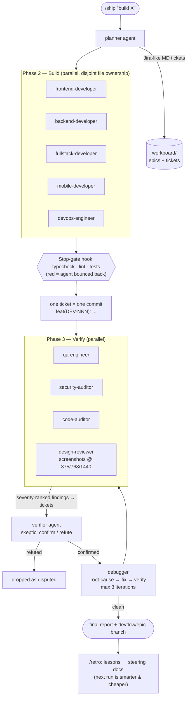

# DevFlow — Agentic Delivery System for Claude Code


A portable agent system you install into any project (or globally) that turns a
single request into a full, quality-gated delivery pipeline:

```text
/ship "build a user dashboard with auth and usage charts"
```



Everything is state-on-disk: tickets are markdown files with frontmatter statuses,
agents communicate by appending to ticket sections, and any new session can resume
the pipeline from the board alone.

## Getting started — step by step

### 0. Prerequisites (one-time)

- **Claude Code** installed and logged in (`npm i -g @anthropic-ai/claude-code`, then `claude`).
- **Git** installed (on Windows this also provides Git Bash, which the quality-gate
  hook uses).
- Keep this repo somewhere permanent (e.g. `C:\Users\<you>\Desktop\startup\like-fable-five`) —
  it is the single source you install *from* and update *in*.

### 1. Install into a project

**Option A — per project** (recommended: the system travels with the repo, teammates
get it via git):

```powershell
# Windows (PowerShell, from this repo's folder)
.\install.ps1 -Target "C:\path\to\your\project"
```

```bash
# macOS / Linux
./install.sh /path/to/your/project
```

This copies `agents/`, `skills/` and `hooks/` into the project's `.claude/` folder.
Commit `.claude/` to the project's git so the whole team has the same pipeline.

**Option B — global** (available in *every* project on this machine, nothing to
copy per project):

```powershell
.\install.ps1 -Global        # or: ./install.sh --global
```

For a brand-new idea with no code yet: just create an empty folder, install into
it, and let `/ship` scaffold the whole project.

### 2. First run in the project

```text
cd C:\path\to\your\project
claude                       # start Claude Code (restart it if it was already open,
                             # so the new agents/skills load)
```

Then, in the Claude Code prompt:

```text
/ship "Build a task manager with user auth, projects, and a kanban board"
```

What happens automatically on the first run:
1. `workboard/` is created (the Jira-style board), plus `workboard/steering/`
   docs describing your stack and conventions.
2. If the project isn't a git repo it becomes one; work happens on a
   `devflow/epic-001-...` branch.
3. The planner presents the ticket breakdown, then building starts — each finished
   ticket is one commit; then QA/security/audit run, the debugger fixes confirmed
   findings, and you get a final report.

Useful variants:

```text
/ship --review "…"    # you approve the plan before any code is written (recommended for big features)
/ship --quick "…"     # small tweak — minimal pipeline
/ship --full "…"      # maximum rigor — all three reviewers
/ship --budget "…"    # cheaper run — worker agents on Sonnet
```

### 3. While it runs / after it finishes

- `/board` — see epics, tickets, statuses, open findings at any time.
- `/ship resume` — if the session was interrupted, a **new** session picks up
  exactly where the board says it stopped.
- When the run finishes, review the report and the `devflow/epic-NNN-*` branch,
  then merge it yourself (the system never merges or pushes for you):
  ```bash
  git checkout main && git merge devflow/epic-001-task-manager
  ```
- Anytime, independently of `/ship`: `/qa`, `/security-audit`, `/debug-findings`,
  `/board add "<idea>"`.

### 4. Updating the system later

Edit or improve anything in **this** repo (agents, craft skills, the pipeline),
then re-run the installer with `-Force` / `--force` on each project (or once with
`-Global`) to roll the update out:

```powershell
.\install.ps1 -Target "C:\path\to\project" -Force
```

### Verify the install worked

In the project, type `/` in Claude Code — you should see `ship`, `board`, `qa`,
`security-audit`, `debug-findings` in the list. If they're missing, restart the
Claude Code session; if still missing, check that `.claude/skills/` and
`.claude/agents/` exist in the project (or `~/.claude/` for global installs).

## Commands (skills)

| Command | What it does |
|---|---|
| `/ship "<task>"` | The full pipeline: plan → tickets → build → QA + security + audit → debug loop → report |
| `/ship --quick "<task>"` | Force the cheap path: no planner spawn, one dev agent, QA only |
| `/ship --full "<task>"` | Force the thorough path: all phases, all three reviewers |
| `/ship --review "<task>"` | Pause after planning — the plan needs your approval before building starts |
| `/ship --budget "<task>"` | Economy run: developer/reviewer agents downgraded to Sonnet (planner, verifier and debugger stay on the session model) |
| `/ship --discover "<idea>"` | Force the discovery interview: 3–5 sharp questions → mini-PRD → then plan (auto-triggers on vague/greenfield requests) |
| `/ship --loop "<task>"` | Loop-until-done: keep cycling (build → verify → debug → re-verify) until the Definition of Done is fully met — no caps, only progress guards. Without the flag, `/ship` asks at launch which you want |
| `/retro [EPIC-NNN]` | Post-epic retrospective: distill recurring findings and hard-won facts into steering docs (auto-runs at the end of standard/full ships) |
| `/devflow-update` | Pull the latest DevFlow from the source repo and reinstall it here |
| `/ship resume` | Continue an interrupted run from the workboard state |
| `/board` | Jira-style status view: epics, tickets, open findings, blockers |
| `/board add <desc>` | Add a backlog ticket without building it |
| `/qa [scope]` | Standalone QA pass on recent changes or a given scope |
| `/security-audit [scope\|full]` | Standalone security review |
| `/debug-findings` | Fix open findings from any of the above |

## Agents

| Agent | Role | Preloaded craft |
|---|---|---|
| `planner` | Analyzes the request + codebase, produces architecture decision and ticket breakdown | — |
| `frontend-developer` | UI features: components, state, styling, a11y | frontend-craft, testing-craft |
| `backend-developer` | APIs, services, data models, migrations, auth | backend-craft, testing-craft |
| `fullstack-developer` | Vertical slices: contract-first server + client | backend-, frontend-, testing-craft |
| `mobile-developer` | RN/Expo/Flutter/native screens, offline, perf | mobile-, frontend-, testing-craft |
| `devops-engineer` | Docker, CI/CD, env config, deploy scripts, health checks | — (standards built in) |
| `qa-engineer` | Executes acceptance criteria + edge probing; severity-ranked findings | testing-craft |
| `verifier` | Skeptic: adversarially confirms/refutes findings so false positives never reach the debugger | — |
| `design-reviewer` | Runs the app, screenshots changed UI at 375/768/1440, critiques hierarchy/spacing/states/slop-tells | frontend-craft |
| `security-auditor` | OWASP-style review of the changed surface; exploit-scenario findings | — |
| `code-auditor` | Pre-merge correctness/architecture/consistency audit | — |
| `debugger` | Root-cause fixes for findings, verify-before-done | debugging-craft, testing-craft |

## Knowledge skills (auto-loaded into agents)

`frontend-craft`, `backend-craft`, `mobile-craft`, `testing-craft`,
`debugging-craft` — the engineering standards each agent works to. They are
model-invocable knowledge (not slash commands) and are preloaded into the relevant
agents via the `skills:` frontmatter field. Edit these to encode your team's own
standards — every agent picks the changes up immediately.

## The workboard

Created at the project root on first `/ship`:

```
workboard/
├── BOARD.md                      # status table + activity log (the "Jira board")
├── epics/EPIC-001-<slug>.md      # goal, architecture decision, DoD, final report
└── tickets/DEV-001-<slug>.md     # self-contained ticket: description, scope,
                                  # acceptance criteria, technical notes (incl. file
                                  # ownership), implementation log, QA/security/audit
                                  # findings, debug log
```

Ticket lifecycle: `backlog → in_progress → built → qa → debugging → done`
(plus `blocked`). Work is `done` only when QA, security and code audit all pass
with zero open CRITICAL/HIGH findings — that gate is enforced by the `/ship` flow.

## Hard guarantees & self-improvement

- **Deterministic quality gate** — developer and debugger agents carry a `Stop`
  hook (`.claude/hooks/devflow-gate.sh`) that runs the project's typecheck/lint/
  tests when the agent tries to finish. Red checks bounce the agent back
  automatically — "done with failing tests" is structurally impossible, not just
  discouraged. The script auto-detects npm/pnpm/yarn/bun, Cargo, Go, and Python
  projects, and passes silently when there's nothing to check.
- **Adversarial verification** — before the debug loop, each CRITICAL/HIGH finding
  goes through the `verifier` (skeptic) agent, which tries to refute it against
  the real code. Refuted findings are marked disputed and dropped; only confirmed
  issues cost a debugging cycle.
- **Agent memory** (`memory: project`) — planner, developers, QA and debugger
  persist durable project knowledge (run/test commands, gotchas, recurring bug
  patterns) across sessions in `.claude/agent-memory/<name>/`. The second `/ship`
  in a project is smarter and cheaper than the first.
- **Steering docs** — the first run generates `workboard/steering/` (`tech.md`,
  `conventions.md`, `product.md`), the project's constitution. Agents read these
  instead of re-exploring the codebase every time. `/ship` keeps them updated as
  epics change the architecture.
- **Git discipline** — each epic runs on its own `devflow/epic-NNN-*` branch; each
  finished ticket is one conventional commit (`feat(DEV-003): ...`), debug fixes
  are `fix(DEV-003): ...`. Full traceability, any stage revertable. Merging and
  pushing stay in your hands (at close, `/ship` *offers* to push and open a PR via
  `gh` with a generated description — it never pushes without your yes).
- **Loop-until-done (opt-in persistence)** — at launch, `/ship` asks: capped run or
  loop-until-done? In loop mode the pipeline cycles until the epic's Definition of
  Done is fully met: blocked tickets escalate (retry → different approach →
  re-plan/split) instead of parking, and unmet DoD items send the run back to the
  owning phase. Two guards prevent runaway spend: stop after two consecutive
  no-progress iterations, hard ceiling of 10 debug cycles — and when a guard fires,
  it reports exactly what's still open instead of faking done.
- **Discovery interview** — vague or greenfield requests trigger 3–5 sharp
  questions (users? MVP flows? out of scope? constraints?) before any planning;
  the answers become a mini-PRD in the epic. Building the wrong thing is the most
  expensive failure mode — this kills it at the source.
- **Visual review** — the `design-reviewer` agent looks at the actual rendered UI
  (screenshots at three breakpoints, driven states) and files design findings into
  the same debug loop as functional bugs. Code review can't see a broken layout.
- **Retro loop** — after each standard/full epic, `/retro` distills recurring
  finding classes and hard-won environment facts into the steering docs. By the
  fifth epic, the pipeline is a project veteran, not a newcomer.
- **Docs stay true** — Phase 5 updates CHANGELOG.md, affected README sections and
  CLAUDE.md before the closing commit.

## Token efficiency

The pipeline scales its cost to the task instead of running everything always:

- **Pipeline modes** — `/ship` triages the request: *quick* (1 small ticket: no
  planner spawn, one dev, QA only), *standard* (2–4 tickets: planner + devs + QA +
  security), *full* (5+ tickets or "production-critical": all three reviewers).
  Force with `--quick` / `--full`.
- **Quality by default, economy on demand** — all agents declare `model: inherit`,
  so every specialist runs on your session's model: run the session on Fable 5 and
  the whole pipeline plans, builds, reviews and debugs at Fable 5 quality. When you
  want a cheaper run, add `--budget`: developers and reviewers drop to Sonnet while
  the planner, verifier and debugger stay on the session model (plan quality and
  fix correctness gate everything else).
- **Pointers, not payloads** — delegation prompts carry ticket paths, not pasted
  file contents; agents write details to ticket files and return ≤10-line summaries;
  reviewers are scoped to changed files only.
- **Skip empty phases** — no findings → no debugger, no re-verify round.

## Design principles

- **One command, one terminal.** The orchestrator runs in your main session; all
  specialists are subagents it spawns and coordinates.
- **State on disk, not in context.** Tickets carry the full context an agent needs
  (BMAD-style story files); agents return short summaries, details live in files.
- **Disjoint file ownership** for parallel tickets — no merge hell.
- **Honest verification.** Reviewers report only executed evidence; the debugger
  never marks a finding fixed without a red→green signal; blocked items are
  reported, not hidden.
- **Native primitives only.** Pure Claude Code agents + skills — no external
  frameworks, daemons, or npm dependencies to break.

## Customizing

- Team standards → edit the `*-craft` skills.
- Pipeline behavior (phases, gates, iteration caps) → `.claude/skills/ship/SKILL.md`.
- Ticket/epic/board formats → `.claude/skills/ship/templates/`.
- New specialist (e.g. `devops-engineer`) → add `.claude/agents/<name>.md` and
  reference it in the planner's assignee list + ship's Phase 2.
